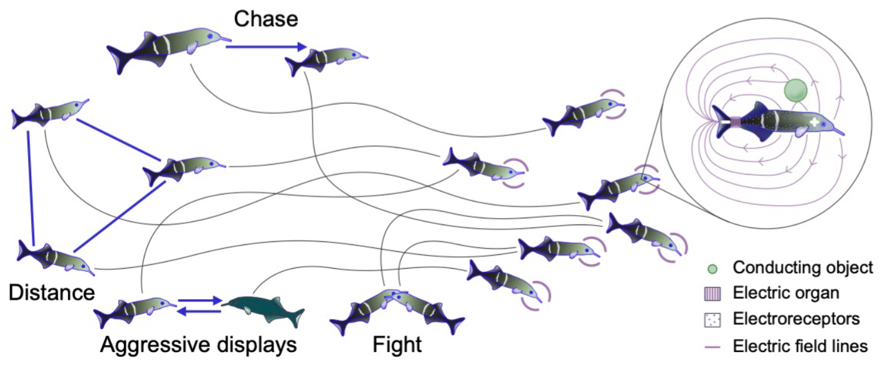

# Online Supplement


Code release and supplementary materials for [Singh and Johnson-Yu et al.,
"Active Electrosensing and Communication in MARL-trained Weakly Electric Fish Collectives"](https://arxiv.org/abs/2511.08436).

Corresponding author: kanaka_rajan@hms.harvard.edu
Technical contacts: satpreetsingh@gmail.com and sjohnsonyu@g.harvard.edu

### BibTex
```bibtex
@article{singh2025understanding,
  title={Understanding Electro-communication and Electro-sensing in Weakly Electric Fish using Multi-Agent Deep Reinforcement Learning},
  author={Singh, Satpreet H and Johnson-Yu, Sonja and Lu, Zhouyang and Walsman, Aaron and Pedraja, Federico and Turcu, Denis and Sharma, Pratyusha and Saphra, Naomi and Sawtell, Nathaniel B and Rajan, Kanaka},
  journal={arXiv preprint arXiv:2511.08436},
  year={2025}
}
```

### Documentation:
* [Installation instructions](INSTALL.md) (Linux + CUDA 12.x; Python 3.10; PyTorch 2.5.1)

### Dataset
[Google Drive link for Data (~50 GB)](https://drive.google.com/drive/folders/1HE5sW-0j5KJgcznHziGUhq7qRz1rq8Hh?usp=drive_link)

The following RUN_DIR(s) were copied over (used in `onpolicy/custom/fish/notebooks/`)
```
/srv/marl/satsingh/marl_fish/NEW/foraging/Dyn_F00_Kb_For_S1
/srv/marl/satsingh/marl_fish/NEW/20260623_homing/Homing2_5MSeed9
/home/satsingh/kr/mfrefactor/onpolicy/custom/rays/results/Homing2Rays2000000Seed1NoFood/
```

## Animations
